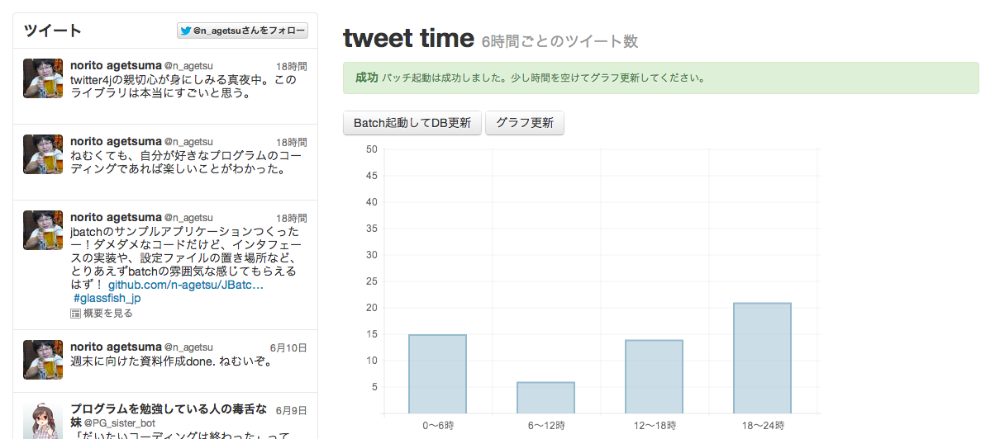

JBatchDemo
==========

JSR352のサンプルアプリケーション。
作者のTwitterタイムライン情報をバッチで取得し、どの時間帯に多くのTweetが行われているか分析します。

動かし方
----------
GlassFish4上での動作を確認しています。
データベースはGlassFishが起動するときに一緒に起動する組み込みDerbyを使っているため、
別途セットアップする必要はありません。

また、Twitter4jを使用していますが、認証にはOAuthを使っていません。
クラスパス直下のtwitter4j.propertiesにコンシューマトークン/シークレット、アクセストークン/シークレットを直接設定してください。
(JAX-RS2.0で導入されたフィルタ機能を使うと、OAuth認証フィルタも簡単に書けるかも)

お願い
---------
このプログラムを商用アプリケーションにコピペすることはやめてください。
あくまでJavaBatchの処理イメージの概要や、設定ファイルの置き場所の確認が目的です。
不具合に関する保証はできません。
